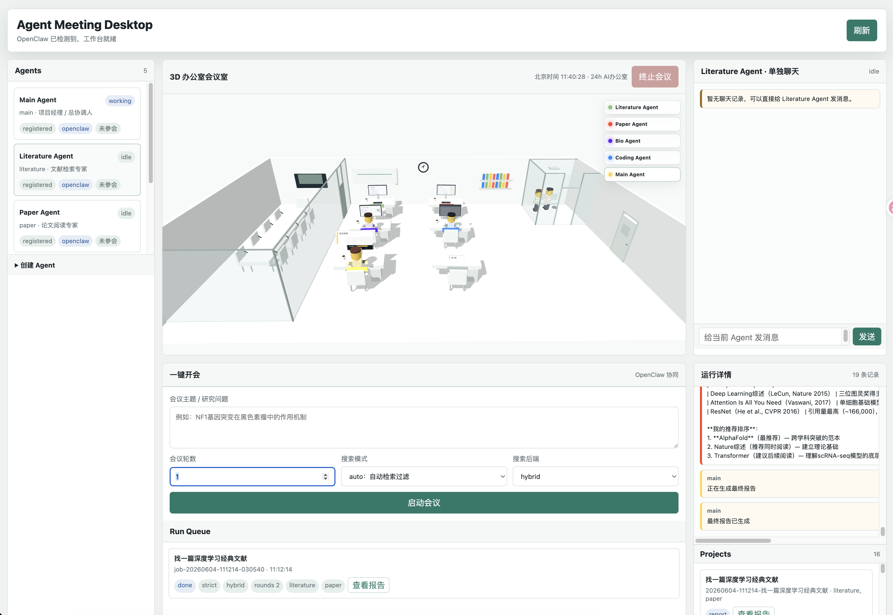

# Agent Meeting Desktop

> A local 3D office for OpenClaw agents: start a meeting, let Main assign the right agents, watch the team move through the office, chat with agents one by one, and review every run from a single queue.

<p align="center">
  
</p>

<p align="center">
  
  
  
  
</p>

## What Is This?

**Agent Meeting Desktop** turns a local OpenClaw workspace into a visual multi-agent control room.

Instead of manually switching between agents, you describe a research question once. Main decides which agents should join, brings them into a meeting room for task briefing, sends them back to workstations, collects their outputs, and produces a final report. Every meeting, single-agent chat, log entry, and report is tracked in the Run Queue.

The app runs on your own machine. It reads agents already created in local OpenClaw and does not require committing OpenClaw credentials, API keys, Telegram settings, sessions, or private workspace files.

## Highlights

- **Local OpenClaw integration**: reads agents through `openclaw agents list --json`, with a fallback to local agent folders.
- **3D office interface**: agents sit, walk, meet, return to desks, idle, work, and show behavior states.
- **Main-controlled meetings**: the user enters a topic; Main chooses which agents to call.
- **Single-agent chat**: click any agent in the sidebar and send a direct message to a fresh OpenClaw session.
- **Run Queue**: meetings, single chats, logs, messages, errors, and final reports live in one place.
- **Real cancellation**: terminating a meeting cancels the backend job and kills active OpenClaw subprocesses.
- **Research context**: optional PubMed / Europe PMC / CrossRef / GEO lookup before agent calls.
- **GitHub-safe by default**: `.gitignore` excludes generated runs, local OpenClaw state, secrets, sessions, cache, and app bundles.

## Quick Start

Install directly from GitHub:

```bash
python3 -m pip install "agent-meetting @ git+https://github.com/chengyuhang218-del/Agents_meeting.git"
agent-meeting serve --host 127.0.0.1 --port 8765
```

Or clone the repository for development:

```bash
git clone https://github.com/chengyuhang218-del/Agents_meeting.git
cd Agents_meeting
python3 -m pip install -e .
agent-meeting serve --host 127.0.0.1 --port 8765
```

Then open:

```text
http://127.0.0.1:8765
```

App-like browser window:

```bash
agent-meeting app --host 127.0.0.1 --port 8765
```

CLI meeting:

```bash
agent-meeting run "Find recent evidence about NF1 mutation in melanoma"
```

The legacy command name also works:

```bash
agent-meetting serve
```

## Requirements

- Python 3.10+
- A working local OpenClaw installation
- Local OpenClaw agents already created
- Modern browser

Optional browser-backed search:

```bash
python3 -m pip install "playwright>=1.44"
```

## Install From A Wheel

The repository also includes a prebuilt wheel package:

```bash
python3 -m pip install "https://github.com/chengyuhang218-del/Agents_meeting/raw/main/packages/agent_meetting-0.1.1-py3-none-any.whl"
agent-meeting serve
```

If you download the file manually, install it with:

```bash
python3 -m pip install path/to/agent_meetting-0.1.1-py3-none-any.whl
agent-meeting serve
```

## macOS DMG Installer

macOS users can download the DMG from the GitHub Release page:

```text
Agent-Meeting-Desktop-0.1.1-bundled-macOS.dmg
```

Open the DMG, drag `Agent Meeting Desktop.app` into `Applications`, then launch it like a normal Mac app.

The bundled DMG includes:

- an embedded Python runtime packaged by PyInstaller
- a private Node.js runtime
- a private OpenClaw CLI package
- the Agent Meeting Desktop browser UI and 3D assets

It does not require the user to install Python, OpenClaw, npm, or Homebrew before launching the app.

Runtime data, OpenClaw config, agents, logs, and meeting output are stored under:

```text
~/Library/Application Support/AgentMeeting/
```

If the bundled runtime is missing or damaged, the app shows a Chinese error dialog and writes details to:

```text
~/Library/Application Support/AgentMeeting/logs/launcher.log
```

## Configuration

Copy the example environment file if you want explicit local settings:

```bash
cp .env.example .env
```

Example variables:

```bash
OPENCLAW_BIN=openclaw
OPENCLAW_AGENT_CONFIG_PATH=
SERVER_PORT=8765
FRONTEND_PORT=
DEFAULT_MEETING_ROUNDS=1
ENABLE_BROWSER_SEARCH=false
```

The server reads `OPENCLAW_BIN` or `AGENT_MEETTING_OPENCLAW_BIN` when calling OpenClaw.

## Connect OpenClaw

Confirm OpenClaw works before launching the UI:

```bash
openclaw status
openclaw agents list --json
```

Agent discovery order:

1. `openclaw agents list --json`
2. fallback to `~/.openclaw/agents/*`

Integration code:

```text
agent_meetting/services/openclaw_service.py
```

Provided service functions:

- `listOpenClawAgents()`
- `getOpenClawAgent(agentId)`
- `sendMessageToOpenClawAgent(agentId, message)`
- `startMeeting(participants, topic)`
- `stopMeeting(meetingId)`

Normalized agent shape:

```json
{
  "id": "literature",
  "name": "Literature Agent",
  "role": "OpenClaw Agent",
  "description": "Literature Agent",
  "source": "openclaw",
  "status": "available"
}
```

## One-Click Meeting

1. Open the web UI.
2. Enter a meeting topic or research question.
3. Choose meeting rounds and search mode.
4. Click `启动会议`.
5. Main selects the participating agents automatically.

When the meeting starts, Main brings the required agents into the meeting room for task briefing. After the briefing, agents return to their desks while OpenClaw calls run in the backend.

### What Does "Rounds" Mean?

A round is one full discussion pass.

- `1` round: fast, cheaper, good for simple questions.
- `2` rounds: agents can react to previous outputs and improve coverage.
- `3+` rounds: deeper discussion, slower and more token-expensive.

For literature/data search, `1-2` rounds is usually enough.

## Single-Agent Chat

Click an agent in the left sidebar to open an individual chat panel.

Each message is sent to the selected OpenClaw agent through the backend. Direct chat uses a fresh session key for each send, so unrelated previous conversations are not merged into the current question.

Typical backend call shape:

```bash
openclaw agent --agent <id> --message "<message>" --json
```

## Run Queue

Every meeting or direct chat can be represented as a run item:

```ts
type RunItem = {
  id: string
  type: "meeting" | "single_chat" | "task"
  status: "pending" | "running" | "stopped" | "completed" | "failed"
  participants: string[]
  logs: string[]
  messages: unknown[]
  finalResult?: string
  error?: string
}
```

The Run Queue shows:

- title
- status
- created time
- participants
- current round / phase
- stopped or completed state
- logs
- agent messages
- final report
- errors

Final reports can be opened as a standalone HTML report page.

## Stop A Meeting

Click `终止会议`.

The backend will:

- mark the job as cancelled/stopped
- set the job cancellation token
- terminate active OpenClaw subprocesses
- prevent later rounds from starting
- write a log event that the meeting was stopped by the user

This is not just hiding the UI.

## Outputs

Local meeting artifacts are written under:

```text
projects/YYYYMMDD-HHMMSS-topic/
  project.json
  tasks/tasks.json
  discussions/meeting.jsonl
  files/*_result.md
  final_report/final_report.md
```

`projects/` is ignored by Git because it contains local run output.

## Project Layout

```text
agent_meetting/
  desktop/                 # Browser UI, Three.js office, chat panels
  services/
    openclaw_service.py    # OpenClaw CLI adapter
    run_queue_service.py   # Run queue data model
  desktop_server.py        # Local HTTP API + frontend server
  orchestrator.py          # Main-led meeting workflow
  agents.py                # Agent call and cancellation layer
  research_tools.py        # Literature/data search context
config/                    # Default agent and meeting rules
docs/                      # Setup and integration docs
examples/                  # Example prompts/materials
```

## API Surface

Common local endpoints:

- `GET /api/agents`
- `POST /api/agents`
- `POST /api/meetings`
- `POST /api/jobs/{job_id}/cancel`
- `GET /api/jobs`
- `GET /api/run-queue`
- `POST /api/agents/{agent_id}/chat`
- `GET /api/projects/{project_id}/report.html`

## Privacy Checklist Before Publishing

Do not commit:

- `.env`
- API keys or tokens
- `projects/`
- `openclaw_workspace/`
- copied `~/.openclaw` config
- Telegram credentials or channel IDs
- sessions, transcripts, cache, memory, plugin state
- generated app bundles
- personal screenshots unless intentionally added

This repository is designed to keep private OpenClaw state outside Git.

## Troubleshooting

### The UI says OpenClaw is missing

```bash
which openclaw
openclaw status
```

Set `OPENCLAW_BIN` if OpenClaw is installed in a custom location.

### Agents do not appear

```bash
openclaw agents list --json
```

Fix OpenClaw first if this command fails.

### Literature or data search is weak

Use `search_mode=strict` for stronger filtering or `search_backend=hybrid` to combine browser and API search.

### Stop does not feel instant

The backend sends cancellation to the active OpenClaw subprocess. A short delay can happen while the process receives `SIGTERM` and, if needed, `SIGKILL`.

## License

Add your preferred license before publishing.
